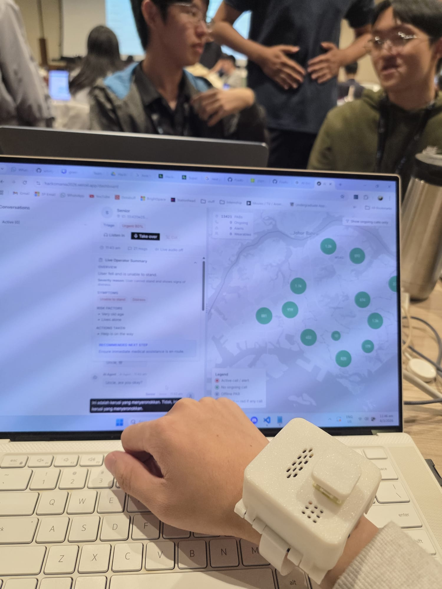
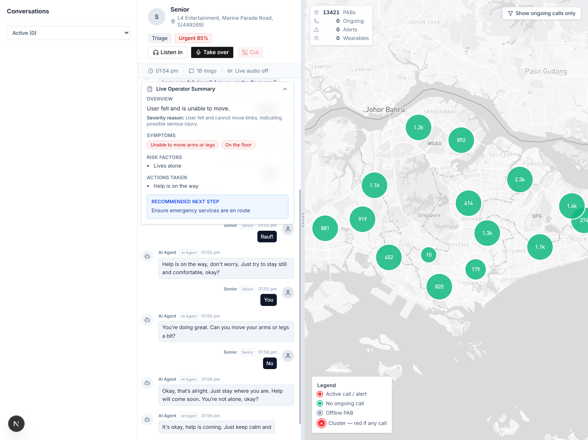
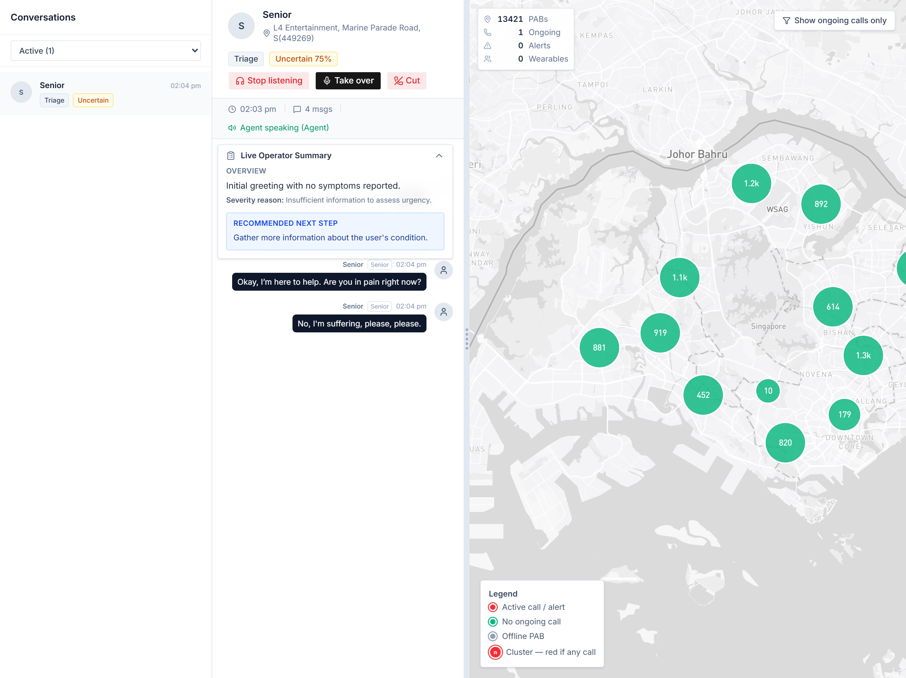
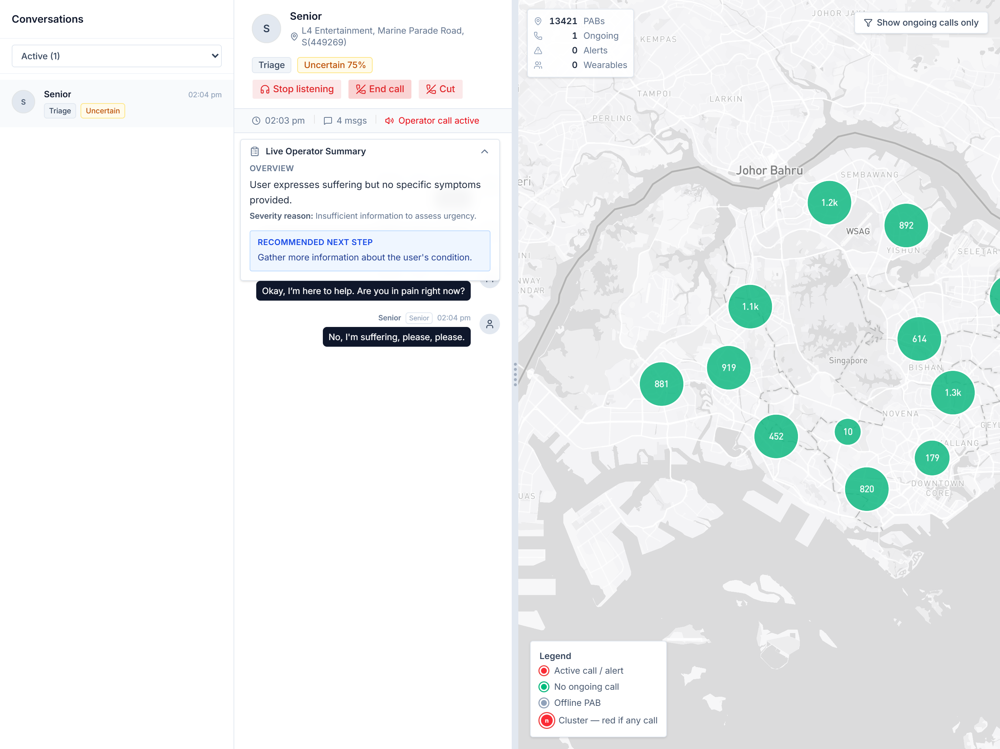
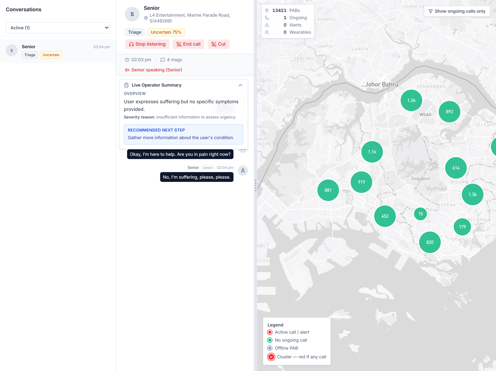

# PABand

A smart emergency response system for elderly residents in Singapore. When a senior activates their Personal Alert Button (PAB), PABand connects them to an AI voice agent that triages the situation in real time — in whatever language they speak — and alerts operators who can monitor, intervene, or dispatch help.

Built at HackOMania 2026 by ``green block``.

The team:
| Member | Background |
|---|---|
| Tan Koh Ming | NSF, SP Computer Engineering alumnus |
| Glenn Wu | NSF, SP Applied AI & Analytics alumnus |
| Ng Wee Herng | NSF, SP Applied AI & Analytics alumnus |
| Chai Shao Yang | Awaiting NS, ACJC alumnus |
| Kenji Koh | Year 1 Student in Nanyang JC |

---



---

## The problem

Singapore's PAB scheme gives elderly residents a button to press when they need help. Today, pressing that button starts a phone call to a human operator. Operators are limited in number, calls take time, and seniors — many of whom speak Hokkien, Cantonese, Malay, or Tamil — sometimes struggle to communicate their situation clearly under stress.

PABand puts an AI agent on the other end of that call. It speaks the caller's language, asks the right questions, and continuously classifies severity so that by the time a human operator looks at the dashboard, they already have a structured picture of what's happening.

---

## How it works

1. A senior presses their PAB wearable (ESP32-based, 3D-printed enclosure).
2. The device opens a WebSocket connection and streams audio to the backend.
3. An AI voice agent ("Kenji") answers immediately, speaks the caller's language, and gathers information about the incident.
4. Every 10 seconds, a triage engine re-evaluates the conversation transcript and updates a severity score (Urgent / Uncertain / Non-urgent) using a weighted medical rubric.
5. Operators see all active calls on a live dashboard — a map of Singapore with PAB locations, real-time transcripts, and an AI-generated incident summary.
6. Operators can listen in silently or take over the call and speak directly to the senior, with the AI muted.

---

## Caller interface

The `/button` page simulates pressing a PAB. It captures microphone audio, runs voice activity detection in-browser, and streams PCM16 to the server over Socket.IO.


---

## Operator dashboard

The dashboard shows every PAB across Singapore on a clustered Mapbox map. Active calls appear in red. Clicking a conversation opens the live transcript, triage badge, and an AI-written operator summary with symptoms, risk factors, and recommended next step.



### Listen in

Operators can silently monitor an ongoing call while the AI handles it.



### Take over

When needed, operators can cut the AI and speak directly to the caller. The dashboard shows who is speaking at any moment.




---

## Languages supported

English, Singlish, Mandarin, Hokkien, Cantonese, Teochew, Hainanese, Malay, Tamil.

The agent auto-detects the caller's language from the first few seconds of speech and responds in kind.

---

## Stack

| Layer | Technology |
|---|---|
| Wearable | ESP32-S3 (DFRobot AI Camera Module), ST LSM6DSR IMU, PlatformIO, 3D-printed housing |
| Backend | Node.js, Express, Socket.IO, WebSockets |
| AI agent | OpenAI Realtime API |
| Triage | GPT-4o-mini with weighted medical rubric |
| Multilingual ASR | FireRedASR2S (EN/ZH), OpenAI Whisper (others) — Modal |
| Frontend | Next.js, React, TypeScript, Tailwind CSS |
| Map | Mapbox GL |
| Database | Supabase (PostgreSQL) |
| Audio storage | Cloudflare R2 |

---

## Project structure

```
client/      Next.js frontend (dashboard + caller interface)
server/      Node.js backend (call routing, triage, audio pipeline)
esp32/       ESP32 firmware (PlatformIO)
models/      Modal ML deployments (language ID, speech-to-speech)
scripts/     Database seeding (PAB locations from HDB data)
3d_models/   Fusion 360 file for the wearable enclosure
```

---

## Running locally

### Backend

```bash
cd server
npm install
# copy .env.example to .env and fill in keys
node index.js
```

Required environment variables: `OPENAI_API_KEY`, `SUPABASE_URL`, `SUPABASE_SECRET_KEY`, `CLOUDFLARE_S3_API`, `CLOUDFLARE_S3_ACCESS_KEY`, `CLOUDFLARE_S3_SECRET_ACCESS_KEY`.

### Frontend

```bash
cd client
npm install
# set NEXT_PUBLIC_MAPBOX_TOKEN in .env.local
npm run dev
```

### Hardware (ESP32)

Open `esp32/` in PlatformIO, set your WiFi credentials and server URL in the config, then flash to an ESP32-S3 AI Camera Module. ``board`` in ``platformio.ini`` should be set to ``dfrobot_firebeetle2_esp32s3``. An LSM6DSR IMU should be plugged into the JST-PH port on the module. The button requires soldering to the 4th microSD slot pin (GPIO12, SCLK).
